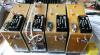
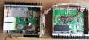
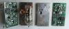
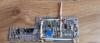
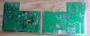
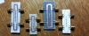

| | [Трансвертер 1296/144МГц](1296_144.md)

| | [Усовершенствованная схема трансвертера 1296/144МГц](https://eu2aa.com/pdfs/1296_v2.pdf)

| | [Термостированный кварцевый генератор 96МГц](TXCO_96.md) |

| | [Антенный Переключатель на P-I-N-диодах 1296МГц 300Вт](AP.md)

| | [Файлы](FILES.md)

| | [Фильтры](FIL.md)

| | [PDF](PDF.md)

|]| [ RM1_AO-21_RS14 ](http://eu2aa.qrz.ru)|
