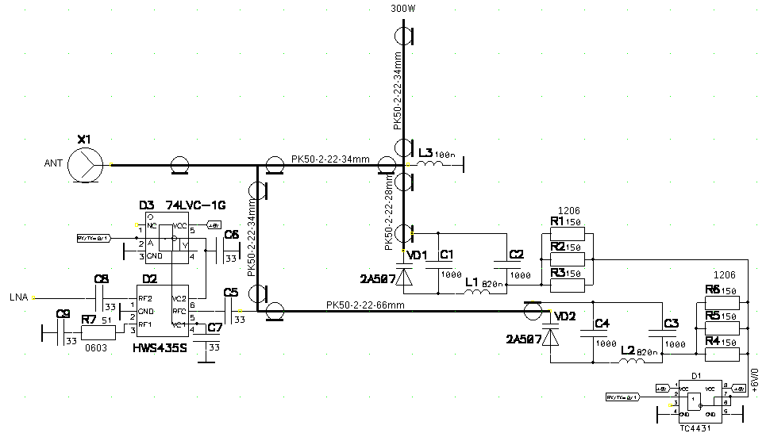
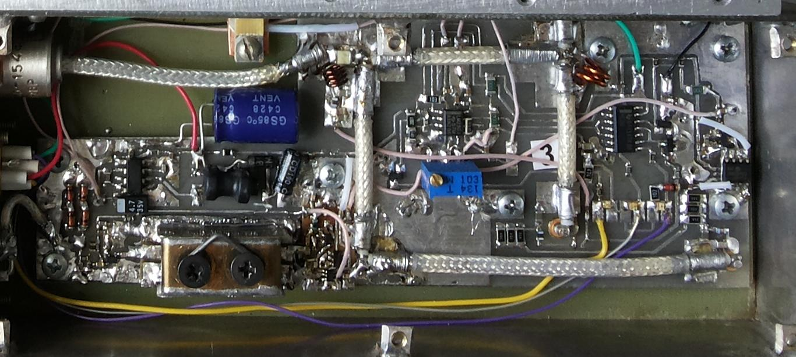
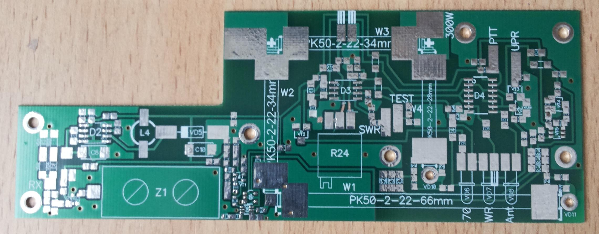
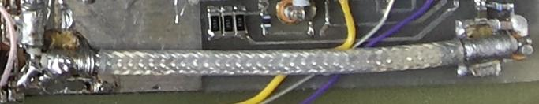

# Антенный Переключатель на P-I-N-диодах 1296МГц 300Вт
#### Полученные результаты
#### Антенный переключатель имеет три основных параметра:

| Наименование параметра, единица измерения	| Значение параметра | 
| ------------- | ------------- |
| 1. Затухание мощности передатчика в тракте ТХ-А, dB			| 0,7 | 
| 2. Потери в тракте приема А-RX, dB						| 0,9 | 
| 3. Пролаз мощности передатчика в тракт приема TX-RX, dB		| минус 32 | 

#### Теория
Отрезки коаксиального кабеля РК50-2-22 в жесткой оболочке представляют из себя достаточно стабильные резонаторы, как λ/4, так и  λ/2.

Измеренная развязка отрезка кабеля  λ/4 с P-I-N-диодом 2А507А на конце приближается к 40dB.

Практически в данной схеме включения реализована развязка в каждом звене не менее 30dB.

Это означает, что если P-I-N-диод 2А507А скоммутирует мощность +30dBm(1Вт), то каждое такое λ/4 или λ/2-звено сможет коммутировать +60dBm(1кВт).

#### Схема

Использовалось единственное напряжение управления - +6В и ключи ТС4431ОЕА (причем китайские).

Отрицательное напряжение для запирания P-I-N-диодов 2А507А  в режиме приема — не потребовалось.

#### Фото образца 

#### Откорректированная печатная плата АП для УМ300Вт

Файл печатной платы в PCAD2006: ap1296.pcb в каталоге Файлы.

#### Настройка
Размеры отрезков некритичны, достаточно выдержать длину разделки кабелей по оплетке с точностью ±1мм.
Однако отрезок  λ/2 требует очень точной настройки. Легкий путь - изменение длины запайки концов оплетки к площадкам на плате.

На фото хорошо видны обрезки стеклотекстолита 3х5мм. Орудуя пинцетом и паяльником, вытесняя припой из под места подпайки оплетки кабеля поочередно с двух концов нужно точно настроить значение пролаза мощности передатчика в тракт приема TX-RX,	минус 32 dB на частоту 1296МГц.

Используя любой маломощный генератор и анализатор спектра, либо приемник.

Примечания.
1 Данная схема использовалась в мелкосерийном 30Вт радиомодеме, выпускаемом 8 лет. Отказов P-I-N-диодов 2А507А не было.

2 На мощности 300Вт схема была испытана на 3 экземплярах. Отказов P-I-N-диодов 2А507А также не было. 

3 Однако 2А507А не предназначен для пайки, поэтому пайку нужно производить кратковременно, в течение 3-4 секунд, не допуская ПЕРЕГРЕВА!

4 На мощности 1кВт не испытывалась, ввиду отсутствия  такой мощности. 

5 При развязке минус 32dB и мощности 300Вт в тракт приема попадет 55-32=33dBm, что недопустимо много. Использование SPDT-ключа HWS435 добавило ослабления еще минус 20dB.

Суммарное ослабление передатчика в тракт приема составило 52dB на всех трех самотравках.

73!
Владимир Чепыженко, EU2AA
