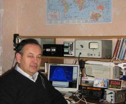
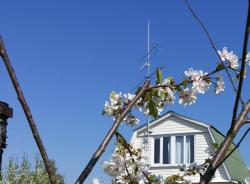
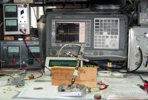
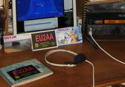
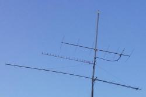

| Home Page | Vladimir | Chepyzhenko |
| ------------- | ------------- | ------------- |
|  Домашняя позиция |  QSL |  |
|  Загородная позиция |  Рабочее место измерений |  Друзья  |
|  Антенны |  | RM1_AO-21_RS14 |

[Любительская аппаратура](AmRig)

 Любительская аппаратура

[Трансвертер 1296/144МГц](AmRig/TRCVR_1296_144.md)

[Термостатированный кварцевый генератор 96МГц](TXCO.md)

[Файлы](AmRig/FILES)

[Фильтры](AmRig/FILTERS)

[PDF](AmRig/PDF)
