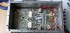
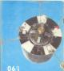

# Любительские конструкции

| | [Любительская аппаратура](AmRig.md) |

| | [TXCO](TXCO.md) |

| | [PA](PA.md) |

| | [Фильтры](FIL.md) |

| | [PHASE-4](P4.md) |

| | [Антенны](Ant.md) |

| | [Файлы](FILES.md) |

| | [PDF](PDF.md) |

| Home Page | Vladimir | Chepyzhenko |
| ------------- | ------------- | ------------- |
| | | Почта  |
| Direct QSL: Vladimir Chepyzhenko, ul.Vilenskaja, 37-29, MOLODECHNO 222306 Belarus | | RM1_AO-21_RS14 |

  

