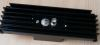
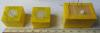
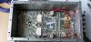
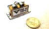
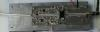
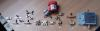
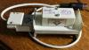

## Любительские конструкции

[Любительская аппаратура   ](AmRig.md)

| | |
|---|---|
|  | [TXCO](https://eu2aa.com/TXCO.html) |
|  | [PA](https://eu2aa.com/PA.html) |
|  | [Фильтры](https://eu2aa.com/FIL.html) |
|  | [PHASE-4](https://eu2aa.com/P4.html) |
|  | [Антенны](https://eu2aa.com/Ant.html) |
|  | [Файлы](https://eu2aa.com/FILES.html) |
|  | [PDF](https://eu2aa.com/PDF.html) |

| Home Page | Vladimir | Chepyzhenko |
| ------------- | ------------- | ------------- |
| | | Почта  |
| Direct QSL: Vladimir Chepyzhenko, ul.Vilenskaja, 37-29, MOLODECHNO 222306 Belarus | | [ RM1_AO-21_RS14 ](http://eu2aa.qrz.ru/rm1.html) |
