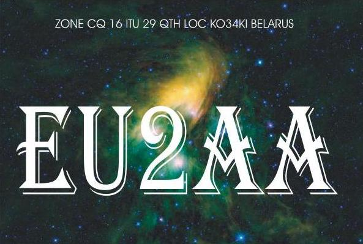
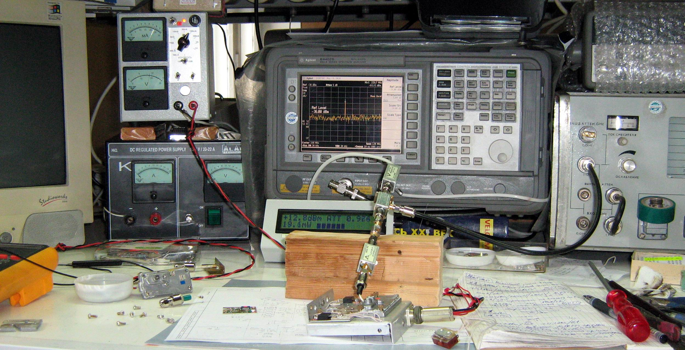
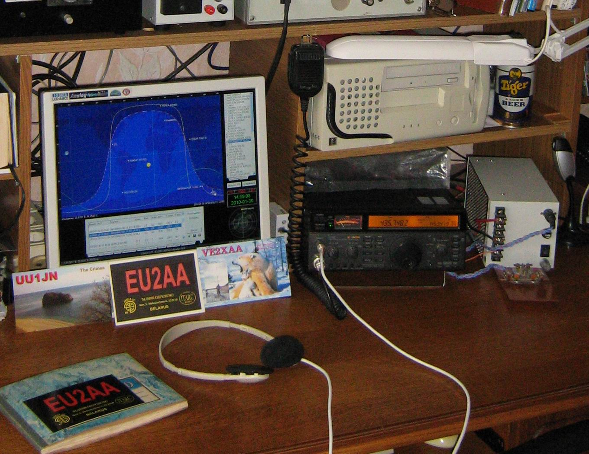
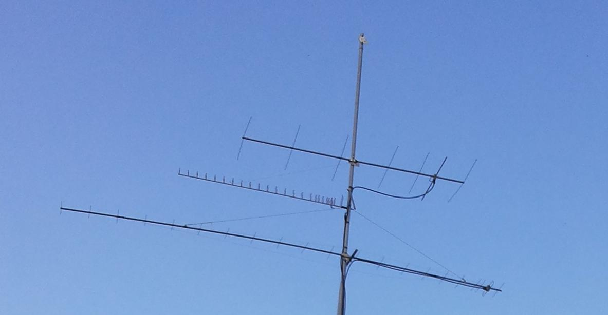
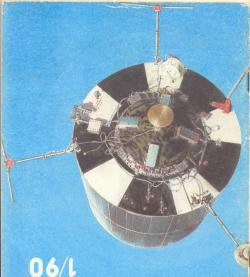

##### eu2aa.github.io
###  EU2AA
| Home | Page | Vladimir | Chepyzhenko |
| ------------- | ------------- | ------------- | ------------- |
|  Home position |  |  |  |
|  Field position |  Working and Measuring Area |  Friends  |  |
|  Antennas|  | RM1_AO-21_RS14 | ![Downloads](photo/29_Downloads.jpg Downloads |
#### Любительская аппаратура
