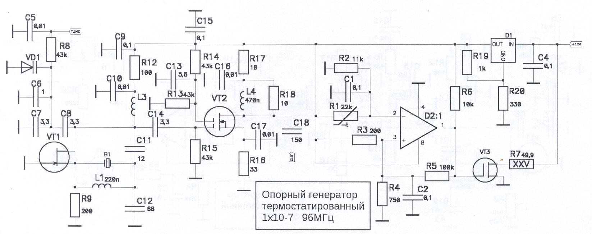
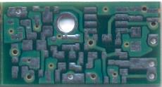
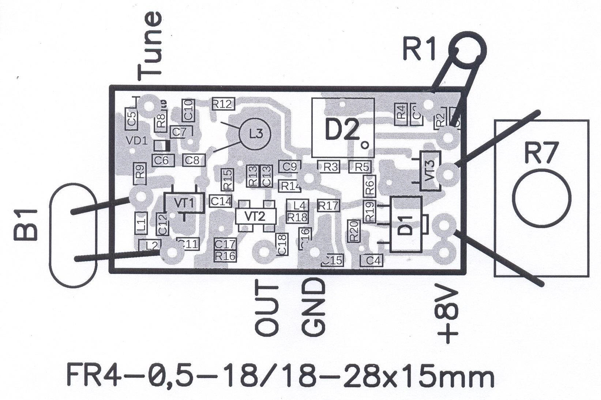

## Термостатированный опорный генератор 96МГц

### 10 способов повышения стабильности опорного генератора
1. Стабилизированное напряжение питания +8В.
2. Дополнительный стабилизатор +6В.
3. Латунный подстроечный сердечник в катушке L3 генератора.
4. Малая переходная емкость С14 с генератора на буферный каскад.
5. Буферный каскад на ПТ BF998.
6. Термостатирование ВСЕХ элементов генератора.
7. Депрон — качественный теплоизоляционный материал.
8. Малый гистерезис компаратора D2 LM2903M - 10мВ. 
9. Выбор оптимального участка на ТЧХ (Термо Частотной Характеристике) резонатора.
10. Термистор посажен на нагреватель через термопасту.

### Электрические параметры
|Наименование параметра, единица измерения	|			Значение параметра|
| ----------------------- | -------------------------------- |
| 1. Выходная частота, МГц						| 	96,0     1  | 
| 2. Форма выходного сигнала						| 	синусоидальная | 
| 3. Относительная нестабильность 					| 	1х10-8      2  | 
| 4. Дополнительная относительная нестабильность |    | 
| 	- от изменения температуры  -30градС - +60градС			| 	1х10-8  |  
| 	- от изменения напряжения питания +8В±1В		| 	5х10-8  |  
| 	- от изменения нагрузки XL					| 	2х10-8	  |  
| 	- от времени								| 	5х10-8  |  
| 5. Температура окружающей среды, ОС				| 	-30градС - +60градС | 
| 6. Время стабилизации температуры термостата, мин. | 
| 	- при +20±10градС							| 	2 | 
| 	- при +60градС								| 	0,5 | 
| 	- при минус 30градС							| 	12 | 
| 7. Стабилизированное напряжение питания, В			| 	8 | 
| 8. Выходной уровень, В пик-пик					| 		1 | 
| 9. Ток потребления термостата ОГ96МГц, А  вкл/откл		| 	0,7/0,35 | 
| 10. Скважность тока потребления  | 
| 	- при +20±10градС							| 	0,2 | 
| 	- при +60градС								| 	0,01 | 
| 	- при минус 30градС							| 	10 | 

Примечания.
1. Определяется частотой кварцевого резонатора
2. При использовании резонатора РВ-89-96МГц

### Схема  

#### Перечень элементов
| Поз. обозначение	|	Наименование | Кол. | Примечание |
| ----------------------- | -------------------------------- | ----------------------- | -------------------------------- |
| B1 Резонатор кварцевый РВ-89-96МГц | 1 |  РК-60-4ЖЛ | 
| |  Конденсаторы: |  |  | 
| C1,C2,C4,C9,C15 | X7R-0603–0,1 мкФ ±5 % | 5 |  | 
| C5,C10,C16,C17 | X7R-0603–0,01 мкФ ±5 % | 4 |  | 
| C7,C8,C14 | NPO-0603-3,3 пФ ±5 % | 3 |  | 
 | C11 | NPO-0603-12 пФ ±5 % | 5 |  | 
 | C12 | NPO-0603-68 пФ ±5 % | 2 |  | 
 | C13 | NPO-0603-5,6 пФ ±5 % | 2 |  | 
 | C18 | NPO-0603-150 пФ ±5 % | 1 |  | 
 | 
 |  | Микросхемы |  |  | 
 | D1 | L78L33_ABUTR | 1 |  | 
 | D2 | LM2903M | 1 |  |  | 
 | 
 |  | Индуктивности |  |  | 
 | L1,L2 | 0603-100nH  | 2 |  | 
 | L3 | 9в.на Ø4мм лат.серд.М3х4 | 1 |  | 
 | L4 | 0603-470nH | 1 |  | 
 | 
 |  | Резисторы |  |  | 
 | R1 | B57891-M891 - 22 kОм ±1 % | 1 |  | 
 | R2* | RC-0805 - 11 kОм ±5 % | 1 |  | 
 | R3,R9 | RC-0805 - 200 Ом ±5 % | 2 |  | 
 | R4 | RC-0805 - 750 Ом ±5 % | 1 |  | 
 | R5 | RC-0805 - 100 kОм ±5 % | 1 |  | 
 | R6 | RC-0805 - 10 kОм ±5 % | 1 |  | 
 | R7 | P1-3-25Вт-49,9 Ом ±1 % | 1 |  | 
 | R8,R13-R15 | RC-0805 - 43 kОм ±5 % | 4 |  | 
 | R12 | RC-0805 – 100 Ом ±5 % | 1 |  | 
 | R16 | RC-0805 – 33 Ом ±5 % | 1 |  | 
 | R17 | RC-0805 – 10 Ом ±5 % | 3 |  | 
 | R18,R19 | RC-0603 - 1 kОм ±5 % | 2 |  | 
 | R20 | RC-0603 – 330 Ом ±5 % | 1 |  | 
 | 
 |  | Полупроводниковые приборы |  |  | 
 | VD1 | Варикап BB857 | 4 |  | 
 | VT1 | MMBF-J310 | 1 |  | 
 | VT2 | BF998 | 1 |  | 
 | VT3 | BS138 | 1 |  | 

### Печатная плата  
  и  

### Монтажная схема 

Вся документация одним файлом: EU2AA_OG96MHz.zip

73!
Владимир Чепыженко, EU2AA
